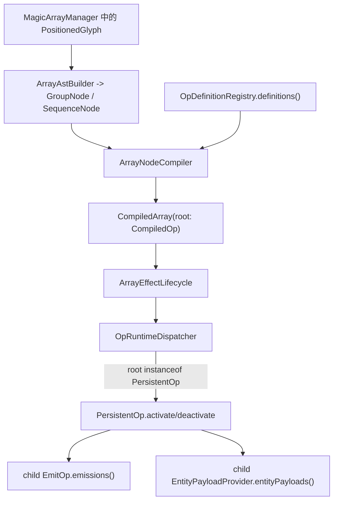

# Operator 系统

本文档描述当前法阵 Operator 系统的编译、注册、调用和生命周期管线，并约定后续新增各级 Op 时允许修改的范围。

当前系统采用隐性结构：

- 编译后的节点统一是 `CompiledOp`。
- 只有同时实现 `PersistentOp` 的 `CompiledOp` 才会被法阵生命周期执行。
- `EmitOp` 和 `EntityPayloadProvider` 是 child 协议。它们作为 root 被编译出来时，不会产生有意义的 runtime effect。
- 新 Op 通过类内部的 `@RegisteredOp + DEFINITION` 进入匹配系统。

## 总体结构

## 核心类型

| 类型 | 文件 | 职责 |
| --- | --- | --- |
| `CompiledOp` | `compile/operator/CompiledOp.java` | 编译后 Op 的最小契约：id、boundary、inputs、color、child 遍历。 |
| `PersistentOp` | `compile/operator/PersistentOp.java` | runtime 生命周期契约。只有实现它的 root 会被 activate/deactivate。 |
| `EmitOp` | `compile/operator/EmitOp.java` | child-only 的发射计划提供者。只输出 `Emission` 数据，不生成实体。 |
| `EntityPayloadProvider` | `compile/operator/EntityPayloadProvider.java` | child-only 的实体 payload 提供者。 |
| `OpDefinition` | `array/compile/OpDefinition.java` | 一个 Op 的编译期匹配规则和 factory。 |
| `RegisteredOp` | `array/compile/RegisteredOp.java` | 标记一个 Op class 需要被自动发现并注册。 |
| `OpDefinitionRegistry` | `array/compile/OpDefinitionRegistry.java` | 发现 `@RegisteredOp`，读取 `DEFINITION`，并保留手动注册扩展入口。 |
| `OpInput` | `array/compile/OpInput.java` | Op 的输入：直接 rune 或已编译 child Op。 |
| `OpInputMatcher` | `array/compile/OpInputMatcher.java` | `OpDefinition.match()` 使用的 rune / child Op matcher。 |
| `CompiledArray` | `array/compile/CompiledArray.java` | root Op、绑定 glyph 和显示颜色。 |
| `ArrayEffectLifecycle` | `array/runtime/ArrayEffectLifecycle.java` | 法阵 effect 生命周期的唯一入口。 |
| `OpRuntimeDispatcher` | `array/runtime/OpRuntimeDispatcher.java` | 编译结果到 runtime 执行的边界。 |

## 编译管线

1. `MagicArrayDetector` 响应 glyph/canvas 变化，把法阵激活委托给 `ArrayEffectLifecycle`。
2. `ArrayEffectLifecycle.activateOrReplace` 调用 `ArrayAstBuilder.build(circleGlyph, manager)` 构建 AST。
3. `ArrayNodeCompiler.compile(ast, mgr.opDefinitions())` 编译每个 group：
   - 直接符号节点变成 `OpInput.Rune`；
   - 嵌套 group 递归编译后变成 `OpInput.Op`；
   - 当前 group 的本地 direct inputs 用注册的 `OpDefinition` 做匹配。
4. `ArrayNodeCompiler` 选择最长的完整匹配。
5. 胜出的 `OpDefinition` 会收到：
   - `boundary`：当前 group 的边界 glyph；
   - `matchedInputs`：只包含 match pattern 消耗掉的 inputs；
   - `inputs`：当前 group 的全部 direct runes 和已编译 child Ops。
6. 最终产物是一个 `CompiledArray`，它持有唯一 root `CompiledOp`。

匹配是 group-local 的。父 Op 看不到 child group 内部的 direct runes，只能看到一个 `OpInput.Op`。

## 生命周期管线

`ArrayEffectLifecycle` 是 effect 生命周期的唯一拥有者：

- 编译 AST 为 `CompiledArray`；
- 替换前先 deactivate 同 root glyph 的旧法阵；
- 调用 `OpRuntimeDispatcher.activate`；
- 注册生成的 `ArrayObject`；
- 将 emitted persistent entities 绑定回 array id；
- glyph 失效时调用 `OpRuntimeDispatcher.deactivate`。

`OpRuntimeDispatcher` 控制实际执行：

- activate 时，只有 `compiled.root() instanceof PersistentOp` 才调用 `activate`；
- 它总是把 root id 和 compiled root 写入 scratch data；
- deactivate 时，先通过 `EmitResult` 丢弃已记录的 emitted entities，再调用 root `PersistentOp.deactivate`。

因此 child-only Op 没有 root 效果。它们可以被编译、被嵌套、被绑定 glyph，但只要不实现 `PersistentOp`，dispatcher 就不会执行它们。

## 当前 Op 层级

### Persistent Root Op

Root Op 创建或管理 runtime effect。当前例子：

- `FireProjectileOp`
- `WaterProjectileOp`
- `ManaProjectileOp`

它们继承 `EntityEffectOp`，复用以下逻辑：

- 从 direct runes 编译 projectile attributes；
- 通过 `emissions()` 统一扫描 child `EmitOp`；
- 没有 child `EmitOp` 时回退到旧 direct-arrow 行为；
- 通过 `payload(...)` 统一扫描 child `EntityPayloadProvider`。

新增 child `EmitOp` 不应该要求修改所有 root Op。如果新 root 需要普通 projectile 发射语义，应复用 `EntityEffectOp.emissions()`。

### Emit Child Op

Emit Op 只规划发射，不生成实体。当前例子：

- `SplitEmitOp`

`SplitEmitOp` 绑定 `split`，读取 direct `arrow` 和 `arrow_up`：

- `arrow`：方向使用 arrow glyph 的 `front`，速度使用 glyph `length`；
- `arrow_up`：方向锁定为当前法阵面的 normal，速度使用 glyph `length`；
- 每个被解码的箭头产生一个 emission；
- 每个 emission 的 `sizeScale = 1 / emissionCount`。

root projectile Op 消费这些 emissions，并决定生成什么实体。

### Payload Child Op

Payload child Op 为 emitted entity 附加行为。当前例子：

- `ElementOp`

`ElementOp` 实现 `EntityPayloadProvider`，返回 entity payloads。它不实现 `PersistentOp`，所以作为 root 没有效果。

### Entity Runtime Payload Op

Entity runtime payload Op 是挂在实体上的序列化行为。当前例子：

- `ElementPayloadOp`

它不是 array root Op，由 entity tick 管线执行，并需要在 `EntityPayloadCodecs` 这类 codec 表中注册。

## 注册边界

系统里有两条独立注册线。

### 符号注册

新增可识别/可绘制 rune 时走这条线：

- 在 `symbol/` 下新增 `Symbol` subclass；
- 新增或复用 `src/main/resources/assets/gyromancy/textures/symbol/` 下的纹理；
- 在 `ModSymbols` 注册；
- 如果识别阈值或模板预期变化，补 symbol matcher 测试。

不要把 Op 行为写进 `Symbol` subclass。还没迁移完的 legacy center-symbol 兼容逻辑除外。

### Op 注册

新增编译期行为时走这条线：

- 在 `compile/operator/` 下新增 `CompiledOp` 实现；
- 暴露静态 `OpDefinition DEFINITION`；
- 在 Op class 上标注 `@RegisteredOp`；
- 如需测试或外部动态扩展，仍可通过 `OpDefinitionRegistry.register(...)` 手动注入；
- 在 `ArrayNodeCompilerTest` 或相邻 focused test 中补编译测试。

普通新增 Op 不应该修改 `ArrayNodeCompiler`。编译器应该只知道 `OpDefinition`、`OpInput` 和 `OpInputMatcher`。
普通新增 Op 也不应该修改 `OpDefinitionRegistry` 的内置列表；registry 只负责发现和校验。

`OpDefinitionRegistry` 的发现顺序：

- 正常 NeoForge runtime 下，优先读取 `ModList.get().getAllScanData()` 中的 `@RegisteredOp` 注解数据；
- JUnit 或普通 classpath 环境没有 `ModList` 时，fallback 扫描 `compile/operator` 包下的 class 文件；
- 发现 class 后读取其 public static `DEFINITION` 字段，并校验 id 不重复。

## 新增各级 Op 的允许修改范围

### 新增符号，复用已有 Op 行为

允许修改：

- 新增 `symbol/<Name>Symbol.java`；
- 修改 `registry/ModSymbols.java`；
- 新增或修改符号 texture/resource；
- 必要时修改 symbol matcher 测试；
- 只修改明确解码该符号的那个已有 Op。

例子：`arrow_up` 新增 `ArrowUpSymbol`，只让 `SplitEmitOp` 解码它。不修改 `OpInputs.projectileAttributes`，因为普通 projectile root 不应该自动把 `arrow_up` 当 direct arrow，除非明确设计成全局 projectile modifier。

不允许：

- 修改 `ArrayNodeCompiler`；
- 修改所有 root Ops；
- 修改 `PersistentOp` 或生命周期类。

### 新增 Persistent Root Op

允许修改：

- 在 `compile/operator/` 新增 root Op class；
- 在 root Op class 上标注 `@RegisteredOp`；
- 只有当多个 root 真正共享逻辑时，才修改 shared base class；
- 补 compile match 和 activation shape 测试。

如果该 root 是 projectile-like entity 发射器，并且需要消费 child `EmitOp` / `EntityPayloadProvider`，优先继承 `EntityEffectOp`。

不允许：

- 扫描具体 child class，例如直接判断 `SplitEmitOp`；
- 让 child `EmitOp` 自己生成实体；
- 除非引入新执行点，否则不要修改生命周期代码。

### 新增 Emit Child Op

允许修改：

- 新增 class 并继承 `EmitOp`；
- 在 Emit Op class 上标注 `@RegisteredOp`；
- 添加 root no-effect 和 nested child usage 测试；
- 在该 Emit Op 内部写局部 decode helper。

新的 Emit Op 可以检查自己的 direct runes 和 child Ops，但只能返回 `EmitOp.Emission` 数据。

不允许：

- 修改每个 projectile root；
- 给 Emit Op 添加 root effect 行为；
- 修改 `EmitOp.Emission`，除非多个 Emit Op 都需要同一个新字段，并且所有 consumer 被同步更新。

### 新增 Payload Child Op

允许修改：

- 新增实现 `EntityPayloadProvider` 的 `CompiledOp`；
- 必要时新增 `EntityPayload` 或 `OnEntityTickOp`；
- 如果新增了序列化 runtime payload，注册 payload codec；
- 在 payload child Op class 上标注 `@RegisteredOp`；
- 补 compile nesting 和 codec round-trip 测试。

不允许：

- 修改每个 root Op。root 应通过 `EntityEffectOp.payload(...)` 消费 payload；
- 把 payload 行为放进 `ArrayEffectLifecycle`。

### 新增 Entity Tick Payload

允许修改：

- 新增 payload class，通常继承 `OnEntityTickOp`；
- 修改 `EntityPayloadCodecs` 注册；
- 添加 entity tick 或 codec 测试。

不允许：

- 除非有明确 `CompiledOp` wrapper，否则不要把它注册成 array root Op；
- 不要从 `OpRuntimeDispatcher` 直接调用它。

### 新增 Op 执行点

这是最高风险改动。只有 `activate/deactivate` 不足够时才做，例如某类 Op 需要独立 server tick，而不是依附 emitted entity tick。

允许修改：

- 新增一个小 runtime interface，例如 `TickingOp`；
- 修改 `OpRuntimeDispatcher`，在 dispatcher/lifecycle 边界统一识别并派发该 interface；
- 只有 array 注册或 scratch ownership 必须变化时，才修改 `ArrayEffectLifecycle`；
- 补 focused lifecycle 测试。

必须遵守：

新增执行点只能在 dispatcher/lifecycle 边界引入一次，不能分散写进所有 root Op，也不能写进 symbol class。

不允许：

- 在 `MagicArrayDetector` 里添加临时扫描；
- 在没有清晰持久化和失效路径的情况下，把生命周期状态存到 `ArrayObject.scratchData` 外面；
- 让 child-only Op 隐式执行，除非它明确实现了新的 runtime interface。

## 维护规则

- `ArrayNodeCompiler` 必须保持 compile-only，不理解 projectile、emit、payload 或 entity 行为。
- `MagicArrayDetector` 必须保持事件入口角色，把 effect activate/deactivate 委托给 `ArrayEffectLifecycle`。
- `OpRuntimeDispatcher` 是 compiled data 到 runtime execution 的边界。
- Root Op 可以消费协议，例如 `EmitOp`、`EntityPayloadProvider`，但应避免消费具体 child class。
- Child Op 只描述意图。root Op 决定这个意图最终生成什么 runtime entity/effect。
- `ArrayEffectDefinition`、`ArrayEffectRegistry`、`ArrayRuntimes` 是兼容 wrapper。新代码应使用 `OpDefinition`、`RegisteredOp`、`OpDefinitionRegistry`、`ArrayEffectLifecycle`。

## 快速流程

### 新增 Emit 变体

1. 创建 `MyEmitOp extends EmitOp`。
2. 添加匹配触发 rune 的 `DEFINITION`。
3. 根据本地 direct inputs 返回 `List<Emission>`。
4. 在 `MyEmitOp` 上标注 `@RegisteredOp`。
5. 添加 root no-effect 和 nested root consumption 测试。

不要修改 `FireProjectileOp`、`WaterProjectileOp`、`ManaProjectileOp`，除非 emission 数据契约本身变化。

### 新增 Projectile Root

1. 创建 `MyProjectileOp extends EntityEffectOp`。
2. 在 `DEFINITION` 中匹配 primary rune。
3. 在 `activate` 中遍历 `emissions()` 并生成目标实体。
4. 如果实体支持 payload，使用 `payload(...)`。
5. 在 `MyProjectileOp` 上标注 `@RegisteredOp`。
6. 添加编译和 runtime shape 测试。

### 新增所有 Projectile Root 共用的 direct rune modifier

1. 修改 `OpInputs.projectileAttributes`。
2. 只有当 modifier 是通用概念时，才给 `EffectAttributes` 加字段。
3. 如果 modifier 统一影响所有 projectile root，修改 `EntityEffectOp` 或 root base 行为。
4. 添加测试证明旧 direct-rune 行为没有变化。

如果 modifier 只对一个 Op 有意义，就在那个 Op 内部解码。
